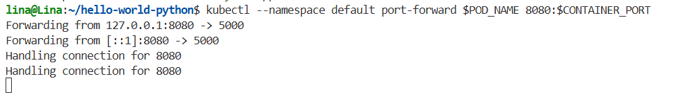
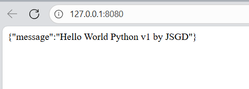

#**HELM**

Esta práctica tuvo como propósito la familiarización con Helm, una herramienta de gestión de paquetes para Kubernetes que facilita la instalación, configuración y despliegue de aplicaciones a través de charts.

Helm permite parametrizar las plantillas YAML utilizadas por Kubernetes, reduciendo la complejidad de la gestión y el versionamiento de despliegues al posibilitar la reutilización de configuraciones mediante valores dinámicos definidos en *values.yaml*.

##**Instalación:** 
El procedimiento se realizó siguiendo la documentación oficial de Helm, específicamente para la distribución Ubuntu.
Los pasos ejecutados fueron los siguientes:

´´´bash
sudo apt-get install curl gpg apt-transport-https --yes
curl -fsSL https://packages.buildkite.com/helm-linux/helm-debian/gpgkey | gpg --dearmor | sudo tee /usr/share/keyrings/helm.gpg > /dev/null
´´´
´´´bash
echo "deb [signed-by=/usr/share/keyrings/helm.gpg] https://packages.buildkite.com/helm-linux/helm-debian/any/ any main" | sudo tee /etc/apt/sources.list.d/helm-stable-debian.list
´´´
´´´bash
sudo apt-get update
´´´

´´´bash
sudo apt-get install helm
´´´

Para verificar la instalación se utilizó el siguiente comando:

´´´bash
helm version --short
´´´
##**Gestión de repositorios**

Helm permite agregar múltiples repositorios de charts. Además, es importante destacar que es posible añadir cuantos repositorios se requieran. El comando presentado a continuación es usado para añadir el repositorio oficial de helm:

´´´bash
helm repo add stable https://charts.helm.sh/stable
´´´
Y de manera opcional también se puede traer el repositorio de bitnami:

´´´bash
helm repo add bitnami https://charts.bitnami.com/bitnami
´´´
Para mantener actualizada la lista de charts disponibles, se ejecutó:

´´´bash
helm repo update
´´´

Asimismo, es posible realizar búsquedas dentro de los repositorios. Para ello, se realiza siguiendo una sintaxis similar a la presentada a continuación: 

´´´bash
helm search binami/nginx
´´´
##**Instalación de un chart**

La instalación de un chart se realiza mediante el comando helm install, seguido de un nombre asignado al despliegue y el nombre del chart, por ejemplo:

´´´bash
helm install mywebserver binami/nginx
´´´

Una vez desplegado, se verificó el estado de los recursos asociados (servicios, pods y deployments) mediante el siguiente comando:

´´´bash
Kubectl get svc, po, deploy
´´´
Esto permite confirmar que los componentes fueron creados y se encuentran en estado *“Running”*.

##**Despliegue de ejemplo**

Con base en la guía propuesta, se ejecutó el comando:

´´´bash
helm install hello-world-python
´´´
Este proceso genera la estructura de plantillas necesarias (deployment.yaml, service.yaml, etc.), que pueden ser personalizadas mediante el archivo *values.yaml*.

Por ejemplo, en este caso, se debia especificar la imagen correspondiente, que se hizo trayendo la imagen desde dockerhub que se encontraba en el repositorio de *icesiops* y además, se debe tener en cuenta el puerto exacto de donde opera el servicio y cambiarlo en el archivo de *values.yaml*

En este caso particular, se cambio la imagen utilizada, por default tenia la imagen de *nginx* que fue reemplazada por la la imagen hello-world-python en su última versión, disponible en el repositorio de *icesiops* en Dockerhub. Además, se configuró el puerto del contenedor de acuerdo con el servicio ofrecido por la aplicación.

Posteriormente, se ejecutó el comando:

´´´bash
helm install hello-world-python ./<path_directory>
´´´
Una vez completada la instalación, en consola se indican los pasos siguientes para realizar la validación. Por ejemplo, para el caso anterior se indico que:

´´´bash
NAME: hello-world-python
LAST DEPLOYED: Thu Oct 30 07:06:34 2025
NAMESPACE: default
STATUS: deployed
REVISION: 1
NOTES:
1. Get the application URL by running these commands:
  export POD_NAME=$(kubectl get pods --namespace default -l "app.kubernetes.io/name=hello-world-python,app.kubernetes.io/instance=hello-world-python" -o jsonpath="{.items[0].metadata.name}")
  export CONTAINER_PORT=$(kubectl get pod --namespace default $POD_NAME -o jsonpath="{.spec.containers[0].ports[0].containerPort}")
  echo "Visit http://127.0.0.1:8080 to use your application"
  kubectl --namespace default port-forward $POD_NAME 8080:$CONTAINER_PORT
´´´
De modo que, se obtiene el nombre del pod, el puerto del contenedor asociado al pod y por último se mapea el puerto, para que, de manera externa se consulte por el puerto 8080 y ese haga un mapeo al puerto interno del contenedor. 

De esta forma, la aplicación fue accesible desde el navegador mediante http://127.0.0.1:8080, mostrando el comportamiento esperado:

